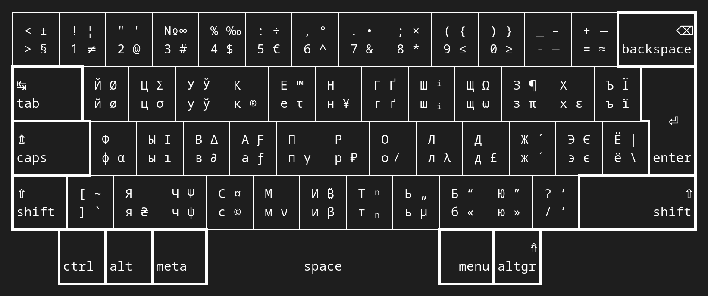

# Apple's Russian Keyboards Xkb Variants

_Russian + Ukrainian-Belorussian xkb layout for Apple keyboards with some
greeks symbols and other extras_

Based on 'ruu' (Russian-Ukrainian United keyboard variant).

Used some kind of logic. Like: all US layout symbols on number keys sould be
reachable with AltGr key and stay on the same keys; all arithmetic operators
are shifted, all somewhat equals to – are not, etc.



### Variants Added

* **ru(macx)** for regular Apple keyboards
* **ru(badmacx)** for „bad“ Apple keyboards (with LSGT and TLDE key-codes
missplaced)
* **us(badmac)** for „bad“ Apple keyboards (with LSGT and TLDE key-codes
missplaced)

For regular Apple keyboards use us(mac), ru(macx) options. For „bad“ ones
use us(badmac), ru(badmacx) pair.

### Installing

_In my case xkb files are stored in `/usr/share/X11/xkb` folder._

* Make backups of replacing system files

```sh
$ cd /usr/share/X11/xkb
$ sudo cp symbols/ru symbols/ru.bak
$ sudo cp symbols/us symbols/us.bak
$ sudo cp rules/base.lst rules/base.lst.bak
$ sudo cp rules/base.xml rules/base.xml.bak
$ sudo cp rules/evdev.lst rules/evdev.lst.bak
$ sudo cp rules/evdev.xml rules/evdev.xml.bak
```

* Go to downloaded folder `xkb-mac-extra-layouts` and replace system xkb
files

```sh
$ cd <your_path>/xkb-mac-extra-layouts
$ sudo cp symbols/ru /usr/share/X11/xkb/symbols
$ sudo cp symbols/us /usr/share/X11/xkb/symbols
$ sudo cp rules/base.lst /usr/share/X11/xkb/rules
$ sudo cp rules/base.xml /usr/share/X11/xkb/rules
$ sudo cp rules/evdev.lst /usr/share/X11/xkb/rules
$ sudo cp rules/evdev.xml /usr/share/X11/xkb/rules
```

* Reboot your system
* Set new variants (see Variants Added above)
* Enjoy your typing

